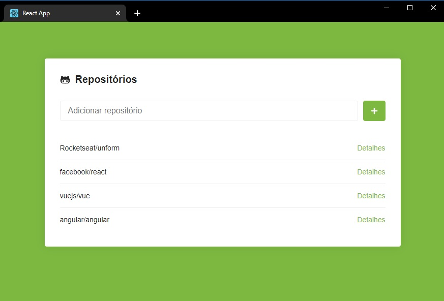
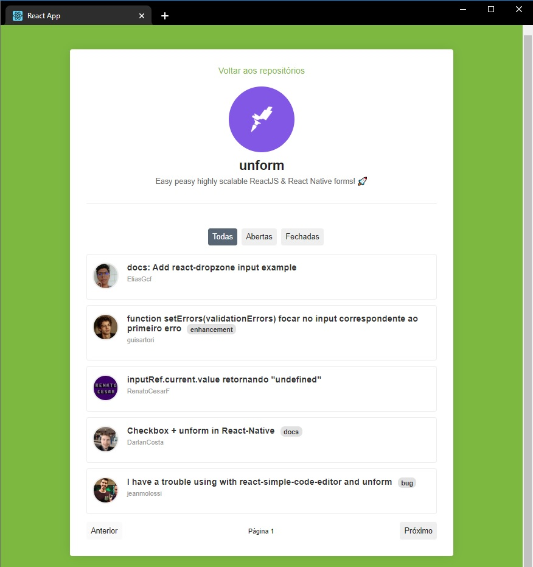

<h1 align="center">
  Desafio 5: Primeiro projeto com ReactJS
</h1>


</br>


## :information_source: Sobre o projeto

### A ideia deste projeto é poder adicionar repositórios do Github via API e encontrar as "issues" dos repositórios. O projeto apresenta basicamente duas páginas: Main e Repository.

## :black_nib: Funcionalidades

### 1. O usuário poderá adicionar o repositório do Github. A aplicação não permite adicionar repositórios duplicados.

### 2. Ao acessar um repositório via link Detalhes, a tela repository será carregada.

### 3. O usuário poderá filtrar as "issues" que o repositário contem, podendo visualizar pelos seguintes status: Todas, Abertas, ou Fechadas.

### 4. O usuário poderá clicar sobre a "issue" para ver mais detalhes da mesma diretamente no Github.

### 5. A página repository exibirá 5 "issues" por vez, podendo o usuário navegar pelos botões de paginação na parte inferir da página.

## :rocket: Tecnologias

### Além do ReactJS também foram utilizadas algumas tecnologias/bibliotecas como:

- Axios
- PropTypes
- Express
- Eslint + Prettier + Babel
- Css
- Html

## :construction_worker: Como utilizar

### É possível clonar o projeto com o comando abaixo:

```
git clone https://github.com/edenex/bootcamp-gostack-modulo-05.git
```

## :memo: Licença

Esse projeto está sob a licença MIT. Veja o arquivo [LICENSE](LICENSE.md) para mais detalhes.

---

Feito com 🧡 by [Edenir de Souza](https://github.com/edenex) 😉
